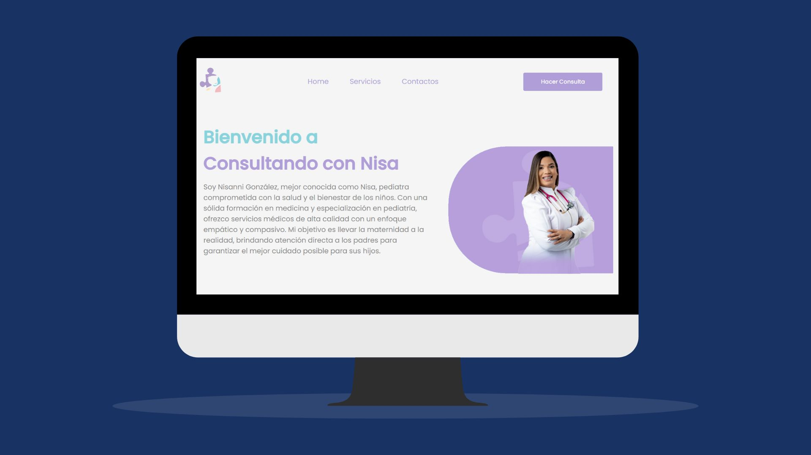
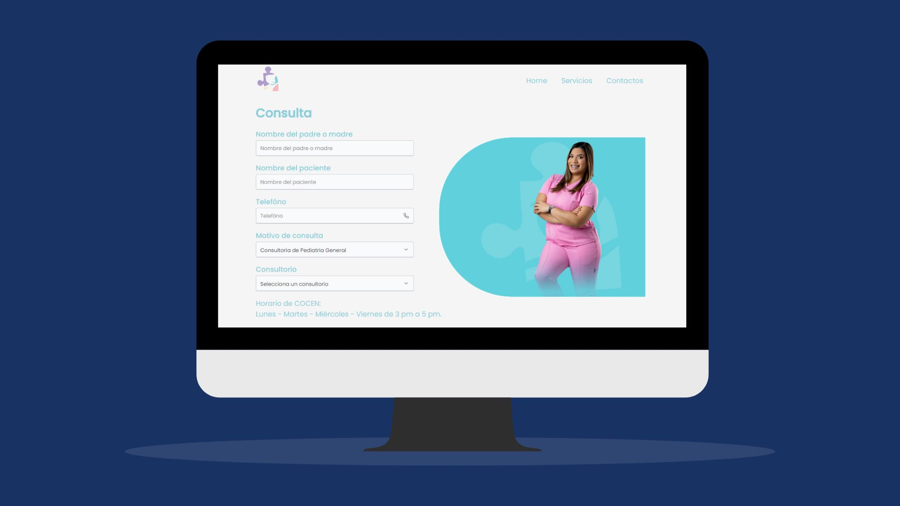
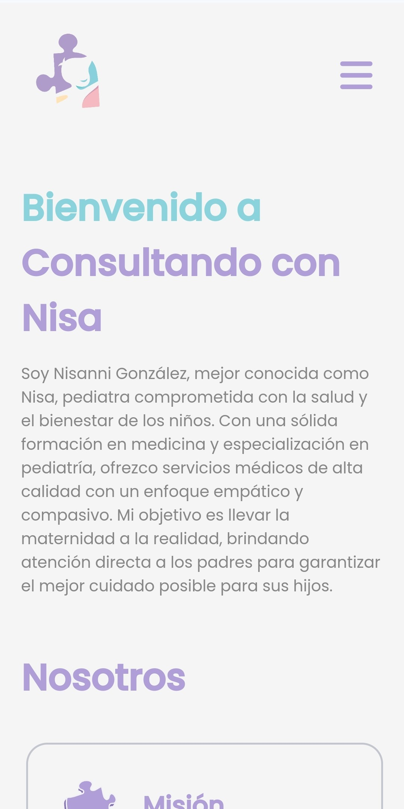
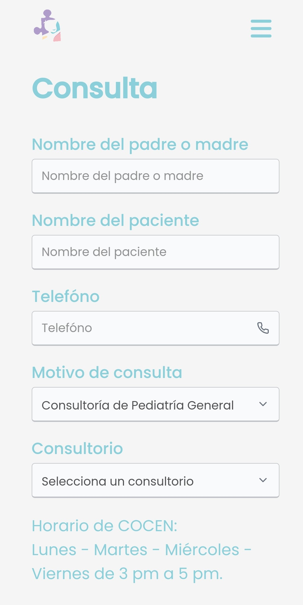

# 🌟 Landing Page para Consultorio Pediátrico

Este proyecto es una landing page moderna y funcional para un consultorio pediátrico. La página permite a los usuarios consultar los servicios ofrecidos y realizar consultas en línea, que se envían directamente al WhatsApp del pediatra mediante un bot personalizado. ¡Todo esto con una experiencia de usuario amigable y un diseño atractivo!

## 📝 Descripción del Proyecto

Esta landing page tiene como objetivo facilitar la comunicación entre los padres y el pediatra. Ofrece una interfaz intuitiva que permite a los usuarios explorar los servicios médicos del consultorio y realizar consultas de manera rápida y eficaz.

Las consultas se envían automáticamente a través de un **bot** que he desarrollado, el cual utiliza una **API personalizada** para enviar las solicitudes directamente al WhatsApp del pediatra.

### ⚙️ Funcionalidades 

- **Diseño moderno y responsivo**: La página se adapta a dispositivos móviles, tablets y escritorios para asegurar que los padres puedan acceder cómodamente desde cualquier dispositivo.
- **Formulario interactivo de consultas**: A través de un formulario en línea, los usuarios pueden hacer preguntas o agendar citas, con las respuestas enviadas automáticamente a WhatsApp.
- **Integración con API personalizada**: El formulario de consultas está conectado a un bot que envía las solicitudes directamente al WhatsApp de la doctora.
- **Animaciones y transiciones suaves**: Se utilizan para mejorar la experiencia del usuario y hacer la página más atractiva.
- **Optimización SEO**: Mejora del rendimiento en los motores de búsqueda para atraer tráfico orgánico.

## 🚀 Tecnologías Utilizadas

- **HTML5**: Estructura semántica del contenido para mejorar la accesibilidad.
- **CSS3**: Diseño responsivo y estilos modernos con flexbox y grid.
- **JavaScript (ES6)**: Funcionalidades dinámicas, validación del formulario y envío de datos a la API.
- **API personalizada**: Comunicación con el bot que automatiza el envío de consultas a WhatsApp.

## 🌐 Características Adicionales

- **Optimización de rendimiento**: Se trabajó en la carga eficiente del sitio para mejorar la experiencia de usuario.
- **Bot personalizado**: Un bot desarrollado por mí gestiona la comunicación automatizada, asegurando respuestas rápidas y eficientes para cada consulta.

## 🌐 Enlace a la Web

Puedes acceder a la landing page de la pediatra Vianel Ventura aquí:

👉 [**Visitar sitio web**](https://www.tu-sitio-web.com](https://consultandoconnisa.azurewebsites.net/) 👈

## 📷 Capturas de Pantalla

  
  
  

  
  

